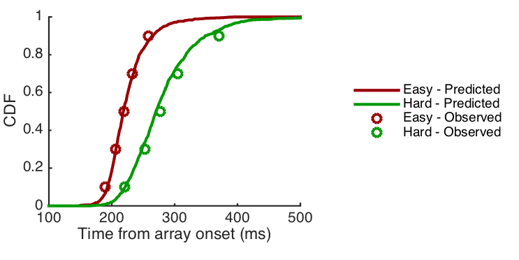

## gated_accumulator_model

Matlab code illustrating a neural computational model of visual decision making (Purcell et al, 2010).

## About

The repository contains Matab functions for modeling the processes by which the brain decides where and when to move the eyes.  Macaque monkeys viewed an array of visual stimuli and made eye movements to the "target" stimulus (e.g., red square) for a juice reward (**Fig 1**).  The stimuli were presented briefly in sequences of trials with the target at a new location each time.  While the monkeys performed the task, activity was recorded from neurons that signaled when the target was in a particular location by increasing their activity (the discharge rate of action potentials).  

     
    <b>Figure 1.</b> Experiment illustration.  Monkeys looked at the odd-ball stimulus (red square) for juice rewards.  Action potentials (upper right monitor) were recorded from neurons in the prefrontal cortex .  The rate of action potentials (lower right monitor) was greater when the target was at the neuron's preferred location (red line) compared to when it was elsewhere (green line).

 

The model proposes that the brain decides where to look by integrating this neural activity over time to a threshold.  Model input is generated by randomly sampling activity from neurons that respond to maximally when the target is at different locations on the screen (**Fig 2**).  The  activity is temporally integrated and the first population to reach threshold determines where and when the eyes should move (**Fig 3**).  The model is validated by comparing the predicted distribution of response times and choice probabilities to those observed for four monkeys (**Fig 4**; 22,542 total choices).  Several parameters (e.g., threshold, integration time constant, competition between neural populations) were fitted to optimize the match to the monkeys behavior.  See [Purcell et al. (2010)](https://github.com/purcelba/purcelba.github.io/blob/master/docs/PurcellHeitzCohenSchallLoganPalmeri2010.pdf) for details about the data, model, and fitting procedure.

    
    <b>Figure 2.</b> Procedure for generating model input.  Randomly sample activity from populations of neurons when the target was inside (top) or outside (bottom) of their preferred location.  Sum the responses and convolve with an exponential kernel.

 

"
    
    <b>Figure 3.</b> Model schematic.  Model input (left) is integrated over time to a threshold (right) to determine where and when the eyes move.  Different parameters (grey) determine the nature of the integration process (see Purcell et al. 2010 for details).

 

"
    
    <b>Figure 4.</b> Model validation.  Cumulative predicted (lines) and observed (circles) response time distributions for trials in which the target was easy (red) or hard (green) to find.  Difficulty was controlled by changing the color of the target.

 

The repository contains a directory, Data, with all of the relevant neural and behavioral data from the experiment, along with Matlab functions to simulate the model.  The relevante files are the following:
- simulateModel (wrapper funtion for generating model input, simulating the module, and plotting the results)
- getModelInput (helper function for concatenating data across different  experimental sessions and monkeys)
- getSDF (helper function for transforming sequences action potentials into spike rate by time, i.e., spike density function)
- model (core model for temporal integration over time)

In practice, the core model functions were implemented in C and parameter optimization was performed on the high-performance computing cluster at the Vanderbilt Advanced Center for Computing for Research and Eduction ([ACCRE](http://www.accre.vanderbilt.edu/)).  Parameters were optimized using Nelder-Mead simplex and Genetic Algorithms implemented in Matlab.   

### Further information

Further details about the data and the model are presented in the following paper:

Purcell, B. A., Heitz, R. P., Cohen, J. Y., Schall, J. D., Logan, G. D., & Palmeri, T. J. (2010). Neurally constrained modeling of perceptual decision making. Psychological review, 117(4), 1113. [pdf](https://github.com/purcelba/purcelba.github.io/blob/master/docs/PurcellHeitzCohenSchallLoganPalmeri2010.pdf)

A more advanced version of the model is described in the following paper:

Purcell, B. A., Schall, J. D., Logan, G. D., & Palmeri, T. J. (2012). From salience to saccades: multiple-alternative gated stochastic accumulator model of visual search. Journal of Neuroscience, 32(10), 3433-3446. [pdf](https://github.com/purcelba/purcelba.github.io/blob/master/docs/PurcellSchallLoganPalmeri2012.pdf)

A lighter summary of the model and background about the neurophysiology of visual decision making can be found here:

Schall, J. D., Purcell, B. A., Heitz, R. P., Logan, G. D., & Palmeri, T. J. (2011). Neural mechanisms of saccade target selection: gated accumulator model of the visual–motor cascade. European Journal of Neuroscience, 33(11), 1991-2002. [pdf](https://github.com/purcelba/purcelba.github.io/blob/master/docs/SchallPurcellHeitzLoganPalmeri2011.pdf)

